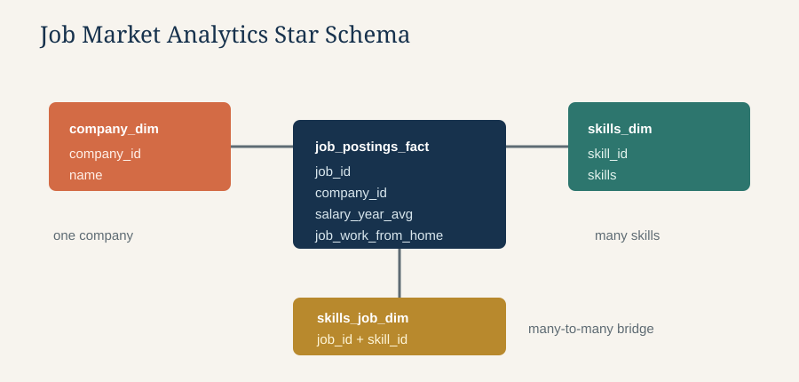

# Data Engineering Skills Market Analysis

SQL exploratory data analysis of remote Data Engineer job postings. This project examines which skills are most requested, which skills are associated with the highest compensation, and which skills offer the best balance between demand and salary.



## Executive Summary

- **Scope:** Three analytical SQL queries over a normalized job-postings schema.
- **Business questions:** What is in demand, what pays well, and what is the most practical skill investment?
- **Approach:** Join the job fact table to the skills bridge and skill dimension, then aggregate and rank results.
- **Outcome:** SQL, Python, cloud platforms, orchestration, distributed processing, and infrastructure skills emerge as strong priorities.

For a quick review, start with [`03_optimal_skills.sql`](03_optimal_skills.sql), then inspect the demand and compensation analyses that support it.

## Research Questions

1. **What are the most in-demand skills for Data Engineers?**
2. **Which skills have the highest median annual salary?**
3. **Which skills provide the strongest combination of demand and compensation?**

## Project Files

| File | Analysis | Main output |
| --- | --- | --- |
| [`01_top_demanded_skills.sql`](01_top_demanded_skills.sql) | Demand for remote Data Engineer roles | Top 10 skills by job-posting count |
| [`02_top_paying_skills.sql`](02_top_paying_skills.sql) | Compensation by skill | Top 25 skills by median salary |
| [`03_optimal_skills.sql`](03_optimal_skills.sql) | Demand and compensation together | Top 25 skills by optimal score |

## Key Findings

### Demand

SQL and Python are the two most frequently requested skills in the remote Data Engineer market. AWS, Azure, Spark, Airflow, Snowflake, Databricks, Java, and Kafka also appear among the leading skills.

### Compensation

Less common technologies such as Rust, Terraform, and Golang have some of the highest median salaries in the analysis. Widely used tools including Kubernetes and Airflow also combine strong compensation with substantially greater job-posting volume.

### Best balance

The combined analysis places Terraform, Python, AWS, SQL, Airflow, Spark, Kafka, and Snowflake near the top. For someone building a practical learning plan, this points to a foundation of SQL and Python, followed by cloud, orchestration, distributed processing, and infrastructure skills.

## Methodology

- Restricts the analysis to remote opportunities using `job_work_from_home = TRUE`.
- Uses `job_title_short = 'Data Engineer'` for the salary and combined analyses.
- Excludes postings without an annual salary from the salary-based analyses.
- Requires at least 100 postings per skill in the salary and optimal-skill analyses to reduce the effect of very small samples.
- Uses the median annual salary, which is less sensitive to unusually high or low salaries than the mean.
- Calculates the optimal score as:

	```text
	optimal_score = (LN(demand_count) * median_salary) / 1,000,000
	```

	The logarithm reduces the influence of very high-volume skills while preserving the value of broad demand. The score is a prioritization metric for this dataset, not a salary forecast.

## Data Model

The queries expect the following relational tables:

- `job_postings_fact`: job posting details, work-from-home flag, title, and salary fields
- `skills_job_dim`: bridge table connecting job postings to skills
- `skills_dim`: skill names and skill IDs

The model uses a star-schema pattern: `job_postings_fact` is the central fact table, `company_dim` and `skills_dim` provide descriptive attributes, and `skills_job_dim` resolves the many-to-many job-to-skill relationship.

The source data is not included in this directory. Load these tables into your SQL environment before running the queries.

## Running the Analysis

The SQL is written for DuckDB and uses DuckDB-supported features such as `ILIKE`, `MEDIAN`, and `COUNT(table.*)`.

1. Start DuckDB in the environment containing the three source tables.
2. Run the SQL files in numerical order:

	 ```sql
	 .read 1_EDA/01_top_demanded_skills.sql
	 .read 1_EDA/02_top_paying_skills.sql
	 .read 1_EDA/03_optimal_skills.sql
	 ```

3. Review the result sets and compare the demand, compensation, and optimal-score rankings.

If your SQL client does not support the `.read` command, open and execute each file as a normal SQL script.

## Important Caveats

- The results describe the job-posting dataset and its collection period; they should not be treated as a complete picture of the entire labor market.
- A posting can list multiple skills, so skill counts are not unique job counts and the counts across skills should not be added together.
- Salary is only available for a subset of postings, which can introduce selection bias.
- The demand query identifies titles containing `data engineer` with `ILIKE`, while the salary and optimal queries use the normalized title `Data Engineer`. Their populations are therefore intentionally different.
- The optimal score is not normalized across datasets and should be used to compare skills within this analysis only.

## Skills Demonstrated

- Relational joins across fact, bridge, and dimension tables
- Filtering and grouping for market analysis
- Aggregations with `COUNT` and `MEDIAN`
- Ranking and limiting analytical results
- Logarithmic scoring for multi-factor prioritization
- Translating SQL output into actionable career insights

## Portfolio Review Guide

When presenting this project, explain the difference between the three populations: the demand query uses a case-insensitive title match, while the salary and optimal-skill queries use the normalized `Data Engineer` title and require a reported annual salary. Also explain why the optimal score uses `LN(demand_count)`: it rewards demand without allowing the largest categories to overwhelm salary.
