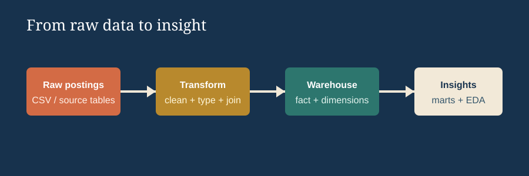

# SQL Data Engineering Portfolio

A practical SQL portfolio built around a normalized Data Engineer job-postings database. The repository combines a sequenced learning path with applied market analysis, demonstrating how to move from schema discovery to decision-ready insights.

## Executive Summary

- Built an eight-lesson SQL curriculum using a realistic fact, dimension, and bridge-table model.
- Wrote analytical queries answering demand, salary, and skill-prioritization questions.
- Applied joins, aggregations, median statistics, CTEs, window functions, data-quality checks, and scoring logic.
- Used DuckDB and GitHub to create a reproducible, reviewable SQL portfolio.

## Start Here

- [SQL Lesson Collection](Lessons/README.md): eight sequenced lessons covering SQL foundations through portfolio analysis
- [EDA Project](1_EDA/README.md): demand, salary, and optimal-skill analysis for remote Data Engineer roles
- [Applied Projects](Projects/README.md): warehouse marts and flat-to-star-schema modeling



## Repository Structure

```text
SQL_Data_Engineering_Projects/
├── Lessons/
│   ├── 01_sql_foundations.sql
│   ├── 02_schema_and_quality.sql
│   ├── 03_filtering_and_case_logic.sql
│   ├── 04_aggregations_and_kpis.sql
│   ├── 05_relational_joins.sql
│   ├── 06_ctes_and_reusable_analysis.sql
│   ├── 07_window_functions.sql
│   ├── 08_portfolio_analysis.sql
│   └── README.md
├── 1_EDA/
│   ├── 01_top_demanded_skills.sql
│   ├── 02_top_paying_skills.sql
│   ├── 03_optimal_skills.sql
│   └── README.md
├── Projects/
│   ├── 2_WH_Mart_Build/
│   └── 3_Flat_to_WH_Build/
├── Resources/
│   ├── data_model.svg
│   └── pipeline.svg
└── README.md
```

## What This Demonstrates

- Querying and profiling relational data
- Filtering, conditional logic, aggregation, and KPI design
- Inner, left, and many-to-many bridge-table joins
- CTEs for layered, maintainable transformations
- Window functions for ranking and comparison
- Median salary analysis and logarithmic multi-factor scoring
- Translating query results into business recommendations

## Data Model

The SQL examples use a normalized job-postings model:

```text
job_postings_fact  --< skills_job_dim >-- skills_dim
        |
        +-- company_dim
```

The source data is not included. Load the four tables into DuckDB before running the queries.

## Skills Demonstrated

### Query Design

`SELECT`, aliases, filtering, `CASE`, `GROUP BY`, `HAVING`, `ORDER BY`, and top-N analysis.

### Relational Modeling

Fact-to-dimension joins, many-to-many bridge-table joins, grain awareness, and completeness checks with `LEFT JOIN`.

### Analytical SQL

CTEs, `MEDIAN`, null handling, `RANK`, `ROW_NUMBER`, `LAG`, logarithmic scoring, and multi-step analysis.

### Engineering Practice

Readable naming, explicit business rules, reusable query layers, documented assumptions, DuckDB validation, and version control.

## Quick Start

```bash
duckdb
```

Inside DuckDB, connect to the database containing the four source tables, then run the lesson files in order. For the applied project, begin with [`1_EDA/README.md`](1_EDA/README.md) and execute its three SQL files.

## SQL Dialect

Examples target DuckDB and use functions including `ILIKE`, `MEDIAN`, and `information_schema`.
